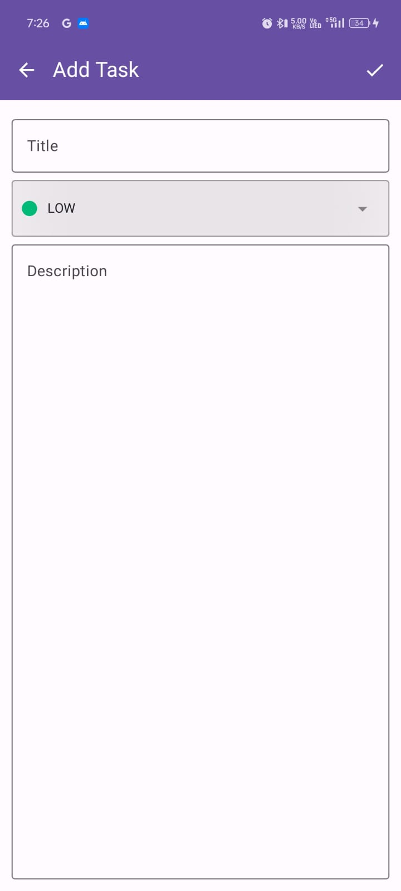

# ToDo Compose App

This is a simple To-Do application built using Jetpack Compose, Room Database, and Dagger Hilt for dependency injection. The app allows users to add, edit, and delete tasks.

## Table of Contents

- [Features](#features)
- [Screenshots](#screenshots)
- [Installation](#installation)
- [Usage](#usage)
- [Libraries Used](#libraries-used)
- [License](#license)

## Features

- Splash Screen
- Home Screen displaying the list of to-dos
- Create/Edit To-Do Screen
- Dependency Injection using Dagger Hilt
- Local storage using Room Database

## Screenshots

### Splash Screen


### Home Screen


### Create To-Do Screen


## Installation

1. Clone the repository:
    ```sh
    git clone https://github.com/yourusername/todo-compose-app.git
    ```
2. Open the project in Android Studio.
3. Build and run the app on an emulator or physical device.

## Usage

### Setting up Dagger Hilt

1. Add the Hilt dependencies in your `build.gradle` files:
    ```gradle
    dependencies {
        implementation "com.google.dagger:hilt-android:2.40.5"
        kapt "com.google.dagger:hilt-compiler:2.40.5"
    }
    ```

2. Annotate your Application class with `@HiltAndroidApp`:
    ```kotlin
    @HiltAndroidApp
    class MyApplication : Application()
    ```

3. Annotate your Android components (Activity, Fragment, etc.) with `@AndroidEntryPoint`:
    ```kotlin
    @AndroidEntryPoint
    class MainActivity : AppCompatActivity() {
        // Your code here
    }
    ```

### Setting up Room Database

1. Add Room dependencies in your `build.gradle` file:
    ```gradle
    dependencies {
        implementation "androidx.room:room-runtime:2.4.2"
        kapt "androidx.room:room-compiler:2.4.2"
    }
    ```

2. Define your entities, DAO, and database:
    ```kotlin
    @Entity(tableName = "todo_table")
    data class Todo(
        @PrimaryKey(autoGenerate = true) val id: Int = 0,
        val task: String,
        val isCompleted: Boolean = false
    )

    @Dao
    interface TodoDao {
        @Insert(onConflict = OnConflictStrategy.REPLACE)
        suspend fun insert(todo: Todo)

        @Query("SELECT * FROM todo_table")
        fun getAllTodos(): Flow<List<Todo>>

        @Delete
        suspend fun delete(todo: Todo)
    }

    @Database(entities = [Todo::class], version = 1, exportSchema = false)
    abstract class TodoDatabase : RoomDatabase() {
        abstract fun todoDao(): TodoDao
    }
    ```

3. Provide the database instance using Hilt:
    ```kotlin
    @Module
    @InstallIn(SingletonComponent::class)
    object DatabaseModule {
        @Provides
        @Singleton
        fun provideDatabase(@ApplicationContext context: Context): TodoDatabase {
            return Room.databaseBuilder(
                context,
                TodoDatabase::class.java,
                "todo_database"
            ).build()
        }

        @Provides
        fun provideTodoDao(database: TodoDatabase): TodoDao {
            return database.todoDao()
        }
    }
    ```

### Using Jetpack Compose

1. Create your composables for different screens:
    ```kotlin
    @Composable
    fun SplashScreen(navController: NavController) {
        // Your splash screen UI here
    }

    @Composable
    fun HomeScreen(navController: NavController, viewModel: TodoViewModel = hiltViewModel()) {
        // Your home screen UI here
    }

    @Composable
    fun CreateTodoScreen(navController: NavController, viewModel: TodoViewModel = hiltViewModel()) {
        // Your create/edit to-do screen UI here
    }
    ```

2. Set up your navigation:
    ```kotlin
    @Composable
    fun NavGraph(startDestination: String = "splash") {
        val navController = rememberNavController()
        NavHost(navController, startDestination = startDestination) {
            composable("splash") { SplashScreen(navController) }
            composable("home") { HomeScreen(navController) }
            composable("create") { CreateTodoScreen(navController) }
        }
    }
    ```

## Libraries Used

- [Jetpack Compose](https://developer.android.com/jetpack/compose) - For building native UI
- [Room](https://developer.android.com/training/data-storage/room) - For local database
- [Dagger Hilt](https://dagger.dev/hilt/) - For dependency injection

## License

This project is licensed under the MIT License.
